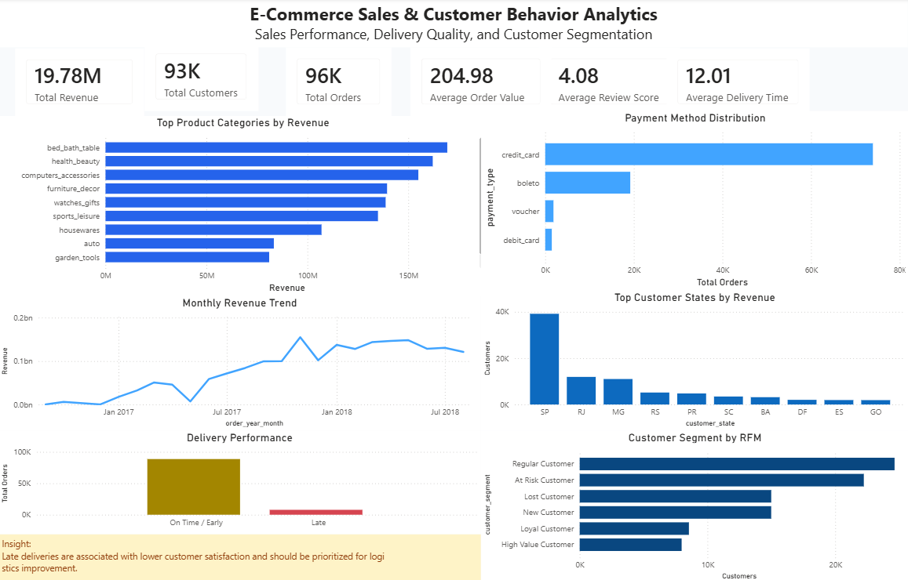

# E-Commerce Sales & Customer Behavior Analytics

## Project Overview

This project analyzes e-commerce transaction data to understand sales performance, customer behavior, product contribution, payment preferences, delivery quality, and customer segmentation.

The analysis was conducted using the Brazilian E-Commerce Public Dataset by Olist. The final output includes data cleaning, exploratory data analysis, SQL business queries, RFM customer segmentation, and an interactive Power BI dashboard.

## Business Problem

E-commerce companies need to continuously monitor sales performance, customer behavior, product contribution, payment methods, and delivery quality to support business decision-making. However, transaction data is often spread across multiple tables, making it difficult to generate clear and actionable insights.

This project aims to transform raw e-commerce data into business insights that can help improve revenue strategy, customer retention, product promotion, and logistics performance.

## Objectives

- Analyze overall sales performance and key business metrics.
- Identify top-performing product categories.
- Analyze customer distribution by region/state.
- Understand customer payment preferences.
- Evaluate delivery performance and its relationship with customer satisfaction.
- Segment customers using RFM analysis.
- Build an interactive dashboard for business monitoring.

## Dataset

The dataset used in this project is the Brazilian E-Commerce Public Dataset by Olist.

Main data tables used:

- Customers dataset
- Orders dataset
- Order items dataset
- Order payments dataset
- Order reviews dataset
- Products dataset
- Sellers dataset
- Product category translation dataset
- Geolocation dataset

## Tools and Technologies

- Python
- Pandas
- NumPy
- Matplotlib
- Seaborn
- SQLite
- SQL
- Power BI
- Jupyter Notebook

## Project Workflow

1. Data Collection  
   Import multiple CSV files from the Olist e-commerce dataset.

2. Data Cleaning  
   Check missing values, duplicate records, date formats, and inconsistent data.

3. Data Integration  
   Merge multiple tables including orders, customers, products, sellers, payments, and reviews.

4. Exploratory Data Analysis  
   Analyze revenue, orders, customers, product categories, customer states, payment methods, review score, and delivery performance.

5. Customer Segmentation  
   Apply RFM analysis to group customers based on recency, frequency, and monetary value.

6. SQL Analysis  
   Create SQLite database and write SQL queries to answer business questions.

7. Dashboard Development  
   Build an interactive Power BI dashboard to visualize sales performance and customer behavior.

## Dashboard Preview



## Key Metrics

| Metric | Value |
|---|---:|
| Total Revenue | 19.78M |
| Total Orders | 96K |
| Total Customers | 93K |
| Average Order Value | 204.98 |
| Average Review Score | 4.08 |
| Average Delivery Time | 12.01 days |

## Key Insights

### 1. Revenue Performance

The platform generated total revenue of approximately 19.78M from 96K delivered orders. The average order value was 204.98, indicating a strong transaction value across delivered purchases.

### 2. Product Category Performance

The top revenue-generating product categories were:

- Bed bath table
- Health beauty
- Computers accessories
- Furniture decor
- Watches gifts

These categories contributed significantly to overall revenue and can be prioritized for future promotions and product bundling strategies.

### 3. Regional Customer Distribution

SP became the dominant customer state in terms of customer count and revenue contribution. This indicates that SP is the strongest market region and should remain a priority for sales, logistics, and retention strategies.

### 4. Payment Method Preference

Credit card was the most frequently used payment method, followed by boleto. This shows that credit card payment plays an important role in customer transactions.

### 5. Delivery Performance

Most orders were delivered on time or earlier than the estimated delivery date. However, late deliveries still occurred and should be prioritized for logistics improvement because delivery delay may affect customer satisfaction.

### 6. Customer Segmentation

Using RFM analysis, customers were segmented into:

- Regular Customer
- At Risk Customer
- Lost Customer
- New Customer
- Loyal Customer
- High Value Customer

Regular Customer and At Risk Customer were the largest segments, indicating an opportunity to improve customer retention and reactivation strategies.

## Business Recommendations

- Optimize promotional campaigns for top-performing product categories such as bed bath table, health beauty, and computers accessories.
- Prioritize SP as the main market region for marketing, logistics optimization, and customer retention programs.
- Improve delivery performance by monitoring late deliveries and identifying sellers or regions with higher delay rates.
- Use customer segmentation to create targeted marketing campaigns.
- Focus on At Risk Customers with reactivation campaigns such as personalized vouchers, email reminders, and special offers.
- Maintain High Value Customers through loyalty programs, exclusive promotions, and personalized product recommendations.
- Increase Average Order Value by applying bundling strategies and minimum-spend vouchers.

## SQL Business Questions

The SQL analysis answers several business questions, including:

- What is the total revenue from delivered orders?
- What is the monthly revenue trend?
- Which product categories generate the highest revenue?
- Which customer states contribute the most revenue?
- What are the most used payment methods?
- How does delivery status affect review score?
- Which customers belong to the High Value Customer segment?
- Which customers are at risk of churn or inactivity?

## Project Structure

```text
DA_04_Ecommerce_Sales_Analytics/
│
├── README.md
├── requirements.txt
│
├── data/
│   ├── raw/
│   └── processed/
│
├── notebooks/
│   ├── 01_data_cleaning.ipynb
│   ├── 02_eda_sales_analysis.ipynb
│   ├── 03_customer_analysis.ipynb
│   └── 04_sql_analysis.ipynb
│
├── sql/
│   └── ecommerce_business_queries.sql
│
├── dashboard/
│   ├── data/
│   ├── Dashboard_Preview.png
│   └── ecommerce_dashboard.pbix
│
├── visualization/
│
└── report/