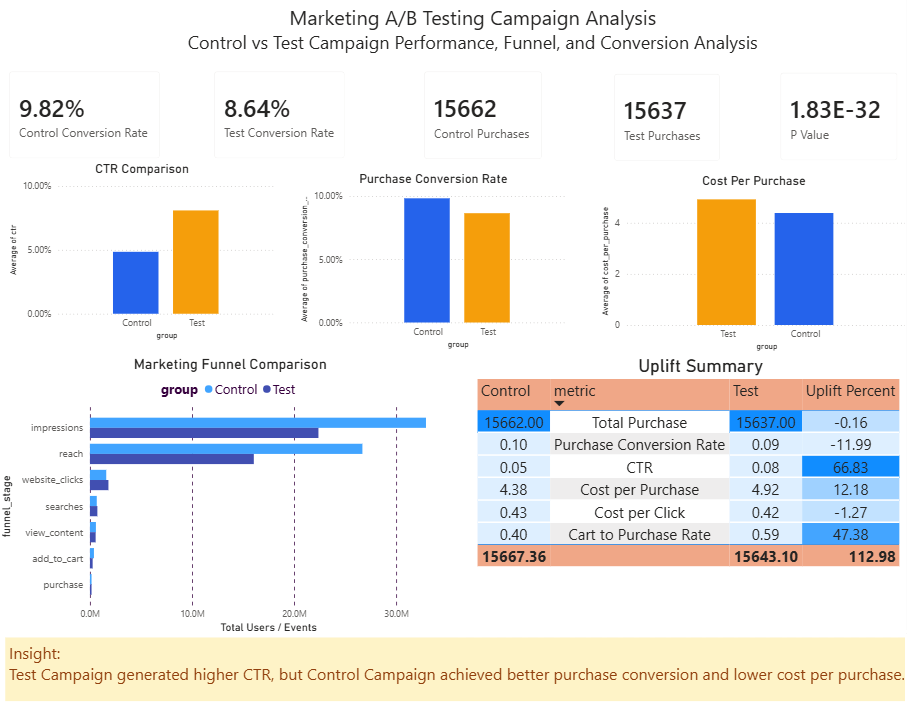

# Marketing A/B Testing Campaign Analysis

## Project Overview

This project analyzes the performance of two digital marketing campaigns: Control Campaign and Test Campaign. The goal is to evaluate whether the Test Campaign performs better than the Control Campaign in terms of user engagement, purchase conversion, campaign efficiency, and funnel performance.

The final output includes exploratory data analysis, A/B testing using a two-proportion z-test, marketing funnel analysis, SQL business queries, visualizations, and an interactive Power BI dashboard.

## Business Problem

A marketing team wants to determine whether a new campaign strategy can improve customer acquisition and conversion compared to the existing campaign. Although a campaign may generate more clicks, it does not always lead to better purchase conversion or lower acquisition cost.

This project helps answer whether the Test Campaign should replace the Control Campaign based on conversion rate, cost efficiency, and statistical significance.

## Objectives

- Compare Control Campaign and Test Campaign performance.
- Analyze CTR, purchase conversion rate, cart-to-purchase rate, cost per click, and cost per purchase.
- Evaluate the marketing funnel from impressions to purchases.
- Perform A/B testing using a two-proportion z-test.
- Identify whether the performance difference is statistically significant.
- Build a Power BI dashboard to summarize campaign performance.
- Provide business recommendations for campaign optimization.

## Dataset

The dataset contains daily marketing campaign performance data for Control Campaign and Test Campaign.

Main columns:

- Campaign Name
- Date
- Spend
- Impressions
- Reach
- Website Clicks
- Searches
- View Content
- Add to Cart
- Purchase

## Tools and Technologies

- Python
- Pandas
- NumPy
- SciPy
- Statsmodels
- Matplotlib
- Seaborn
- SQL
- Power BI
- Jupyter Notebook

## Project Workflow

1. Data Loading  
   Load control and test campaign datasets.

2. Data Cleaning  
   Standardize column names, convert date and numeric fields, and handle missing values.

3. Feature Engineering  
   Create campaign performance metrics such as CTR, purchase conversion rate, cart-to-purchase rate, cost per click, and cost per purchase.

4. Campaign Performance Analysis  
   Compare campaign performance across spend, impressions, clicks, purchases, and cost efficiency.

5. A/B Testing  
   Apply a two-proportion z-test to evaluate whether the purchase conversion rate difference between Control and Test campaigns is statistically significant.

6. Funnel Analysis  
   Analyze user movement across marketing funnel stages from impressions to purchases.

7. Dashboard Development  
   Build an interactive Power BI dashboard to summarize campaign performance and business insights.

## Dashboard Preview



## Key Metrics

| Metric | Control Campaign | Test Campaign |
|---|---:|---:|
| Purchase Conversion Rate | 9.82% | 8.64% |
| Total Purchases | 15,662 | 15,637 |
| CTR | 4.85% | 8.09% |
| Cart to Purchase Rate | 40.12% | 59.12% |
| Cost per Click | 0.43 | 0.42 |
| Cost per Purchase | 4.38 | 4.92 |

## A/B Testing Result

The A/B test was conducted using a two-proportion z-test to compare purchase conversion rates between the Control Campaign and Test Campaign.

| Metric | Value |
|---|---:|
| Control Conversion Rate | 9.82% |
| Test Conversion Rate | 8.64% |
| Z-statistic | -11.86 |
| P-value | 1.83e-32 |
| Significance Level | 0.05 |

Since the p-value is far below 0.05, the difference between the Control Campaign and Test Campaign is statistically significant.

However, the Test Campaign did not outperform the Control Campaign in purchase conversion. The Control Campaign achieved a higher purchase conversion rate.

## Key Insights

- Test Campaign achieved a higher CTR than Control Campaign, with an uplift of 66.83%, indicating stronger click engagement.
- Control Campaign achieved a higher purchase conversion rate, with 9.82% compared to 8.64% for Test Campaign.
- The conversion rate difference was statistically significant based on the two-proportion z-test.
- Test Campaign showed stronger cart-to-purchase performance, suggesting that users who reached the cart stage were more likely to complete purchases.
- Test Campaign had slightly lower cost per click, but higher cost per purchase, indicating lower purchase efficiency.
- Total purchases were almost the same between both campaigns, but Test Campaign required higher spending.

## Business Recommendations

- Keep Control Campaign as the primary campaign for purchase conversion because it achieved a higher conversion rate and lower cost per purchase.
- Use elements from Test Campaign to improve upper-funnel engagement because it generated a higher CTR.
- Investigate the post-click experience of Test Campaign, including landing page quality, audience targeting, offer relevance, and checkout flow.
- Run another experiment by combining the high CTR elements of Test Campaign with the stronger conversion strategy of Control Campaign.
- Monitor cost per purchase as the main decision metric, not only CTR, because high click volume does not always lead to higher purchase efficiency.

## SQL Business Questions

The SQL analysis answers several business questions, including:

- What is the total campaign performance by group?
- Which campaign has the higher CTR?
- Which campaign has the higher purchase conversion rate?
- Which campaign has the lower cost per purchase?
- How does the funnel performance compare between Control and Test campaigns?
- What is the uplift of Test Campaign compared to Control Campaign?
- Which campaign should be recommended based on purchase conversion and cost efficiency?

## Project Structure

```text
DA_05_Marketing_AB_Testing/
│
├── README.md
├── requirements.txt
│
├── data/
│   ├── raw/
│   │   ├── control_group.csv
│   │   └── test_group.csv
│   └── processed/
│       ├── ab_test_result.csv
│       ├── ab_testing_cleaned.csv
│       ├── campaign_summary.csv
│       ├── funnel_summary.csv
│       └── uplift_summary.csv
│
├── notebooks/
│   └── 01_ab_testing_analysis.ipynb
│
├── sql/
│   └── ab_testing_queries.sql
│
├── visualization/
│   ├── Dashboard_Preview.png
│   ├── purchase_conversion_rate.png
│   ├── cost_per_purchase.png
│   └── marketing_funnel_comparison.png
│
└── report/