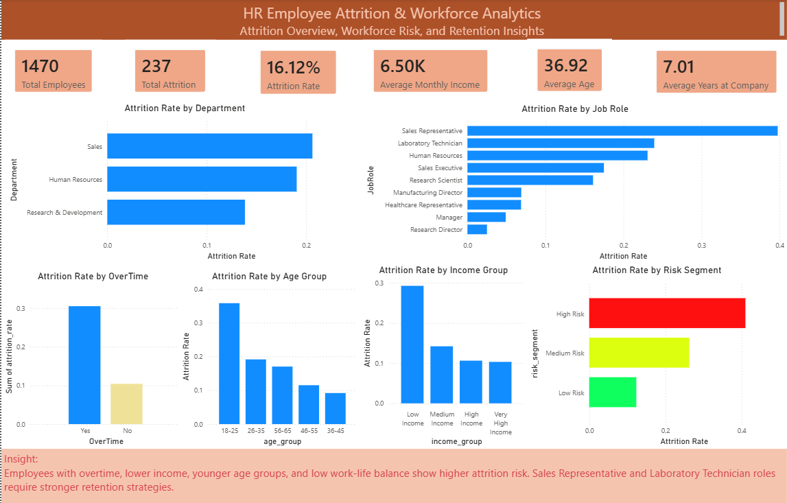

# HR Employee Attrition & Workforce Analytics

## Project Overview

This project analyzes employee attrition and workforce risk using the IBM HR Analytics Employee Attrition dataset. The goal is to identify key factors associated with employee turnover, such as department, job role, overtime, age group, income group, job satisfaction, work-life balance, and employee risk segment.

The final output includes data cleaning, exploratory data analysis, SQL business queries, employee risk segmentation, visualizations, and an interactive Power BI dashboard.

## Business Problem

Employee attrition can negatively impact business performance, team productivity, recruitment cost, and workforce stability. HR teams need data-driven insights to identify which employee groups have higher attrition risk and what factors may contribute to turnover.

This project helps HR stakeholders understand employee attrition patterns and prioritize retention strategies for high-risk employee segments.

## Objectives

- Analyze overall employee attrition rate.
- Identify departments and job roles with higher attrition risk.
- Analyze the relationship between overtime and attrition.
- Compare attrition across age groups and income groups.
- Evaluate attrition based on job satisfaction and work-life balance.
- Create employee risk segmentation.
- Build a Power BI dashboard for HR monitoring and retention insights.
- Provide actionable business recommendations.

## Dataset

The dataset used in this project is the IBM HR Analytics Employee Attrition & Performance dataset.

Main columns used:

- Age
- Attrition
- Department
- JobRole
- OverTime
- MonthlyIncome
- JobSatisfaction
- WorkLifeBalance
- YearsAtCompany
- TotalWorkingYears
- DistanceFromHome
- EnvironmentSatisfaction
- JobInvolvement
- PerformanceRating

## Tools and Technologies

- Python
- Pandas
- NumPy
- Matplotlib
- Seaborn
- SQL
- Power BI
- Jupyter Notebook

## Project Workflow

1. Data Loading  
   Load the HR employee attrition dataset.

2. Data Understanding  
   Inspect dataset shape, column types, missing values, and duplicate records.

3. Data Cleaning  
   Create attrition flag, age group, income group, and employee risk segment.

4. Exploratory Data Analysis  
   Analyze attrition patterns by department, job role, overtime, age group, income group, job satisfaction, and work-life balance.

5. Risk Segmentation  
   Segment employees into Low Risk, Medium Risk, and High Risk groups based on overtime, job satisfaction, and work-life balance.

6. SQL Analysis  
   Write SQL business queries to answer key HR analytics questions.

7. Dashboard Development  
   Build a Power BI dashboard to visualize employee attrition, workforce risk, and retention insights.

## Dashboard Preview



## Key Metrics

| Metric | Value |
|---|---:|
| Total Employees | 1,470 |
| Total Attrition | 237 |
| Attrition Rate | 16.12% |
| Average Monthly Income | 6.50K |
| Average Age | 36.92 |
| Average Years at Company | 7.01 |

## Key Insights

### 1. Overall Attrition

The company has an overall attrition rate of 16.12%, with 237 employees leaving out of 1,470 total employees.

### 2. Attrition by Department

Sales has the highest attrition rate among departments, followed by Human Resources and Research & Development. This indicates that Sales requires stronger retention monitoring and employee engagement strategies.

### 3. Attrition by Job Role

Sales Representative has the highest attrition rate among job roles, followed by Laboratory Technician and Human Resources. These roles should be prioritized for retention initiatives.

### 4. Attrition by OverTime

Employees who work overtime have a significantly higher attrition rate than employees who do not work overtime. This suggests that workload and work-life balance may be important factors influencing employee turnover.

### 5. Attrition by Age Group

Employees in the 18–25 age group show the highest attrition rate. Younger employees may require stronger onboarding, career development, mentoring, and engagement programs.

### 6. Attrition by Income Group

Low Income employees show the highest attrition rate compared to higher income groups. Compensation and benefit review may help reduce turnover risk in this segment.

### 7. Attrition by Risk Segment

High Risk employees have the highest attrition rate, followed by Medium Risk and Low Risk employees. This segmentation helps HR prioritize intervention strategies.

## Business Recommendations

- Prioritize retention programs for Sales Representative, Laboratory Technician, and Human Resources roles.
- Monitor employees who work overtime and evaluate workload distribution to reduce burnout risk.
- Improve career development and mentoring programs for younger employees, especially those in the 18–25 age group.
- Review compensation strategy for Low Income employees to reduce attrition risk.
- Improve work-life balance and job satisfaction through employee engagement initiatives.
- Use risk segmentation to proactively identify employees who may require HR intervention.
- Conduct regular workforce monitoring through HR dashboards to support data-driven retention decisions.

## SQL Business Questions

The SQL analysis answers several HR business questions, including:

- What is the overall employee attrition rate?
- Which department has the highest attrition rate?
- Which job roles have the highest attrition risk?
- How does overtime relate to attrition?
- Which age groups show higher attrition?
- Which income groups have higher turnover risk?
- How do job satisfaction and work-life balance relate to attrition?
- Which employee risk segment should be prioritized for retention action?

## Project Structure

```text
DA_06_HR_Employee_Attrition_Analytics/
│
├── README.md
├── requirements.txt
│
├── data/
│   ├── raw/
│   │   └── WA_Fn-UseC_-HR-Employee-Attrition.csv
│   └── processed/
│       ├── hr_attrition_cleaned.csv
│       ├── kpi_summary.csv
│       ├── attrition_by_department.csv
│       ├── attrition_by_jobrole.csv
│       ├── attrition_by_overtime.csv
│       ├── attrition_by_age_group.csv
│       ├── attrition_by_income_group.csv
│       ├── attrition_by_job_satisfaction.csv
│       ├── attrition_by_work_life_balance.csv
│       └── risk_segment_summary.csv
│
├── notebooks/
│   └── 01_hr_attrition_analysis.ipynb
│
├── sql/
│   └── hr_attrition_queries.sql
│
├── dashboard/
│   ├── Dashboard HR Attrition.pbix
│   └── Dashboard_Preview.png
│
├── visualization/
│   ├── attrition_by_department.png
│   ├── attrition_by_job_role.png
│   ├── attrition_by_overtime.png
│   └── attrition_by_risk_segment.png
│
└── report/