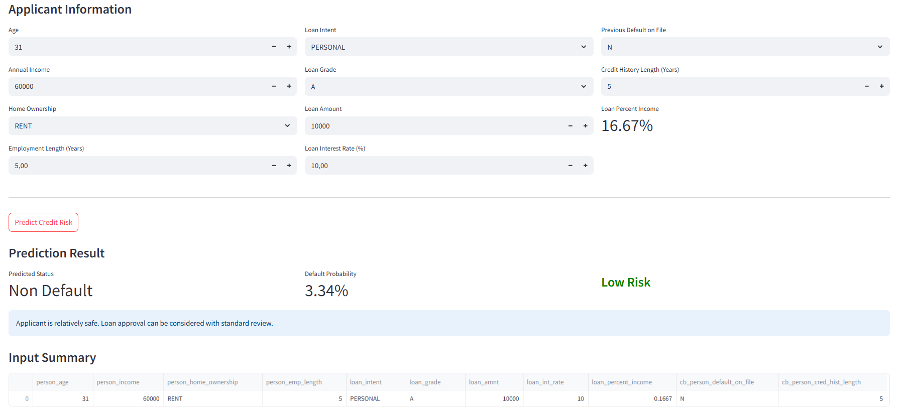

# Credit Risk Scoring: Loan Default Prediction

## Project Overview

This project builds a machine learning model to predict loan default risk based on borrower profile, loan information, credit history, and financial indicators.

The goal is to classify applicants into default or non-default categories and generate credit risk segments such as Low Risk, Medium Risk, and High Risk. The project includes data cleaning, exploratory data analysis, model comparison, model evaluation, risk scoring, and business recommendations.

## Streamlit App

This project also includes a Streamlit-based web application that allows users to input applicant information and generate a credit risk prediction using the trained machine learning model.

The app predicts:

- Loan default status
- Default probability
- Credit risk segment
- Business recommendation
- Applicant input summary

### App Features

- Interactive applicant input form
- Automatic loan percent income calculation
- Default probability prediction
- Risk segmentation into Low Risk, Medium Risk, and High Risk
- Business recommendation based on predicted default probability

### App Preview



## Business Problem

Financial institutions need to assess whether a loan applicant is likely to default before approving a loan. Manual credit assessment can be time-consuming and inconsistent, while data-driven risk scoring can support faster and more objective credit decisions.

This project helps identify high-risk applicants and supports better credit approval, risk monitoring, and lending strategy.

## Objectives

- Analyze borrower and loan characteristics related to default risk.
- Identify high-risk groups based on loan grade, home ownership, loan intent, and loan percent income.
- Build and compare machine learning classification models.
- Evaluate model performance using precision, recall, F1-score, ROC-AUC, and confusion matrix.
- Generate default probability scores for applicants.
- Segment applicants into Low Risk, Medium Risk, and High Risk groups.
- Provide business recommendations for credit risk management.

## Dataset

The dataset used in this project is a credit risk dataset containing borrower profile, loan details, and credit history information.

Main columns:

- person_age
- person_income
- person_home_ownership
- person_emp_length
- loan_intent
- loan_grade
- loan_amnt
- loan_int_rate
- loan_status
- loan_percent_income
- cb_person_default_on_file
- cb_person_cred_hist_length

Target column:

- loan_status  
  - 0 = Non Default
  - 1 = Default

## Tools and Technologies

- Python
- Pandas
- NumPy
- Matplotlib
- Seaborn
- Scikit-learn
- Joblib
- Jupyter Notebook

## Project Workflow

1. Data Loading  
   Load the credit risk dataset.

2. Data Understanding  
   Inspect dataset shape, column types, missing values, target distribution, and feature characteristics.

3. Data Cleaning  
   Handle missing values in `person_emp_length` and `loan_int_rate` using median imputation.

4. Exploratory Data Analysis  
   Analyze default rate by home ownership, loan intent, loan grade, and loan percent income risk level.

5. Feature Engineering  
   Create loan status labels and initial risk level based on loan percent income.

6. Model Training  
   Train and compare Logistic Regression, Random Forest, and Gradient Boosting models.

7. Model Evaluation  
   Evaluate models using accuracy, precision, recall, F1-score, ROC-AUC, confusion matrix, and classification report.

8. Risk Scoring  
   Generate default probability scores and classify applicants into Low Risk, Medium Risk, and High Risk segments.

9. Model Saving  
   Save the best-performing model as a `.pkl` file for future prediction use.

## Key Metrics

| Metric | Value |
|---|---:|
| Total Applicants | 32,581 |
| Total Default | 7,108 |
| Default Rate | 21.82% |
| Average Income | 66,074.85 |
| Average Loan Amount | 9,589.37 |
| Average Interest Rate | 11.01% |
| Average Loan Percent Income | 17.02% |

## Exploratory Data Analysis Insights

### 1. Default Rate by Risk Level

Applicants in the High Risk segment based on loan percent income show the highest default rate.

| Risk Level | Default Rate |
|---|---:|
| Low Risk | 12.15% |
| Medium Risk | 20.10% |
| High Risk | 70.32% |

### 2. Default Rate by Loan Grade

Default rate increases significantly as loan grade worsens.

| Loan Grade | Default Rate |
|---|---:|
| A | 9.96% |
| B | 16.28% |
| C | 20.73% |
| D | 59.05% |
| E | 64.49% |
| F | 70.54% |
| G | 98.44% |

### 3. Default Rate by Home Ownership

Applicants with RENT and OTHER home ownership categories show higher default rates compared to MORTGAGE and OWN.

### 4. Default Rate by Loan Intent

Debt consolidation, medical, and home improvement loans show relatively higher default rates compared to other loan intents.

## Model Comparison

| Model | Accuracy | Precision | Recall | F1-score | ROC-AUC |
|---|---:|---:|---:|---:|---:|
| Gradient Boosting | 92.63% | 94.60% | 70.18% | 80.58% | 92.64% |
| Random Forest | 91.30% | 83.79% | 74.54% | 78.90% | 92.50% |
| Logistic Regression | 81.36% | 55.15% | 77.99% | 64.61% | 87.12% |

The best-performing model is **Gradient Boosting**, achieving the highest ROC-AUC and strong precision for default prediction.

## Best Model Performance

Best model:

```text
Gradient Boosting