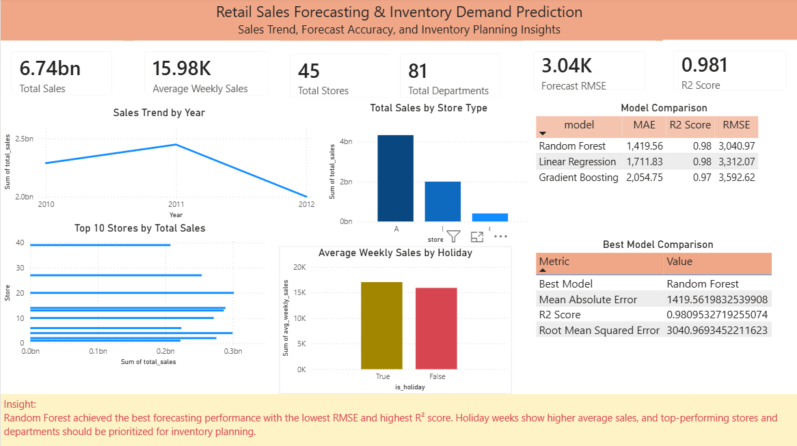
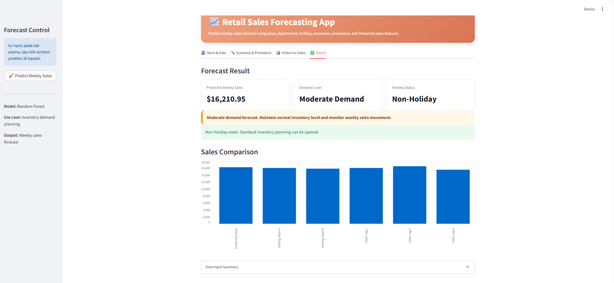
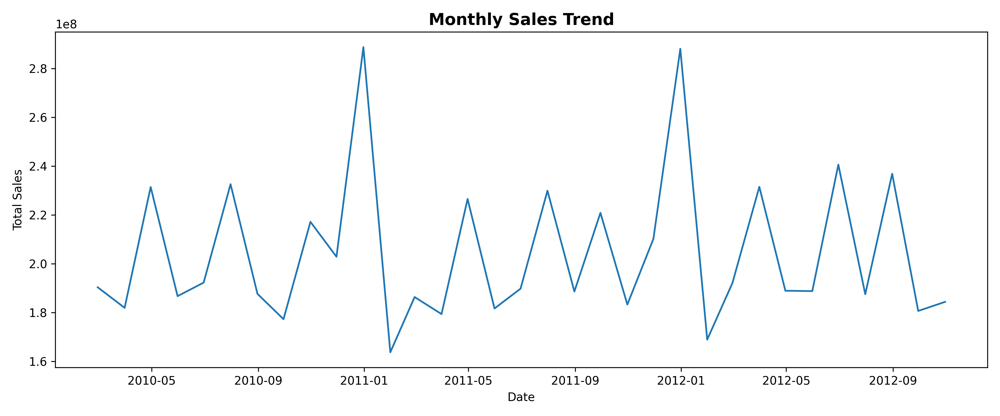
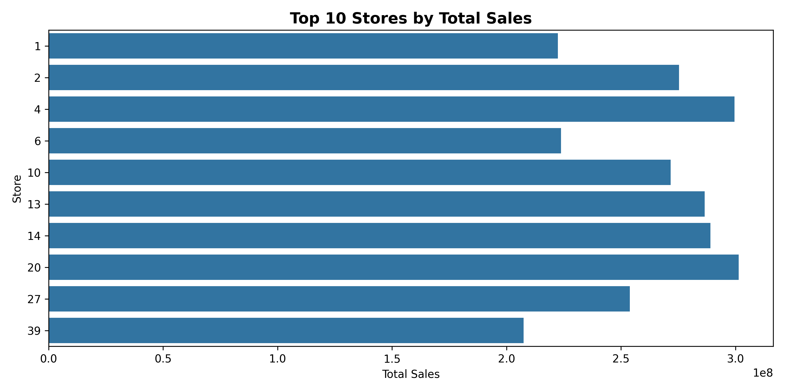
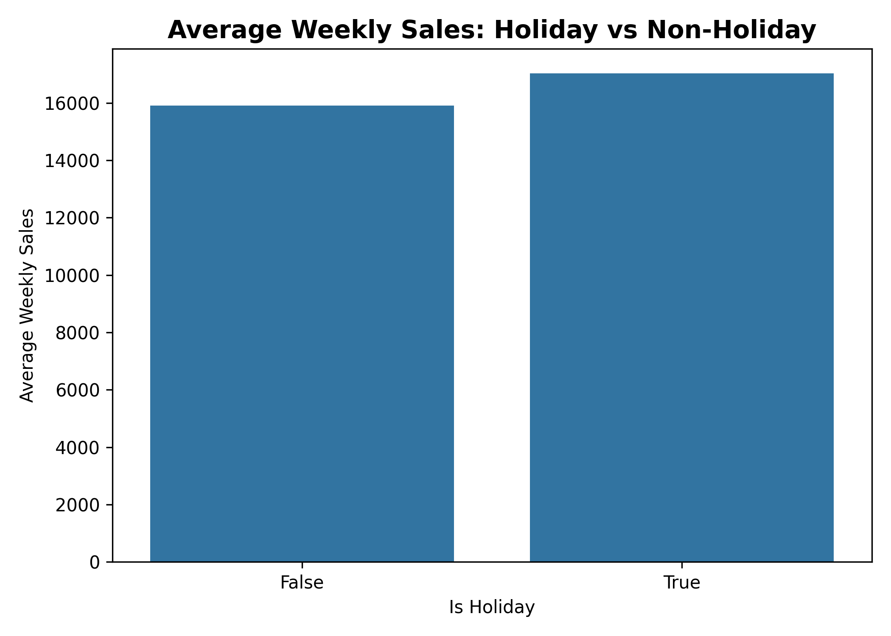
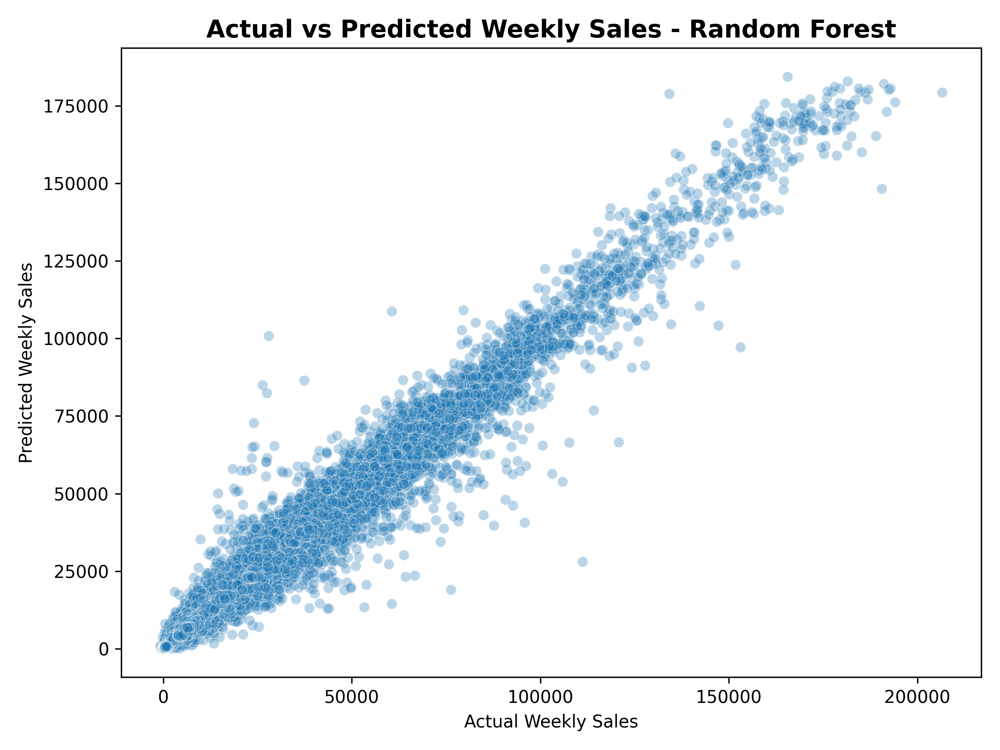
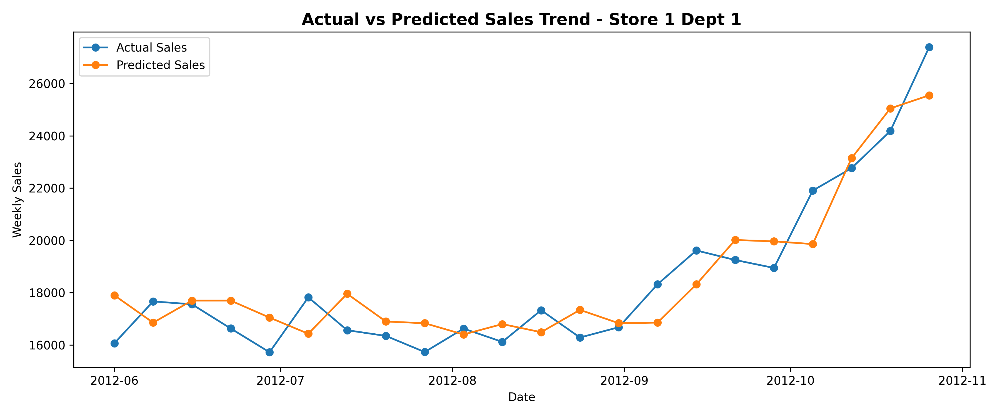

# Retail Sales Forecasting & Inventory Demand Prediction

## Project Overview

This project builds an end-to-end retail sales forecasting system using Walmart weekly sales data. The goal is to predict weekly sales demand based on historical sales patterns, store information, department, holiday effects, markdown promotions, and external economic factors.

The final output includes data cleaning, exploratory data analysis, time-based feature engineering, machine learning forecasting models, model evaluation, Power BI dashboard, Streamlit application, visualization, and business recommendations for inventory planning.

## Business Problem

Retail companies need accurate demand forecasting to optimize inventory, reduce overstock, avoid stockouts, and improve sales planning. Poor forecasting can lead to excessive inventory costs, missed sales opportunities, inefficient replenishment, and lower customer satisfaction.

This project helps estimate weekly sales demand so that business teams can make better inventory and demand planning decisions.

## Objectives

- Analyze weekly sales trends across stores and departments.
- Evaluate holiday and non-holiday sales patterns.
- Identify top-performing stores and departments.
- Analyze store type contribution to total sales.
- Build time-based features such as lag sales and rolling average.
- Train and compare machine learning forecasting models.
- Evaluate model performance using MAE, RMSE, and R² score.
- Generate sales forecasts and prediction error analysis.
- Build a Power BI dashboard for sales and forecasting insights.
- Develop a Streamlit app for interactive weekly sales prediction.
- Provide business recommendations for inventory demand planning.

## Dataset

The dataset contains Walmart historical sales data and supporting store and economic features.

Main files:

- `train.csv`
- `test.csv`
- `features.csv`
- `stores.csv`

Main columns used:

- Store
- Dept
- Date
- Weekly_Sales
- IsHoliday
- Temperature
- Fuel_Price
- MarkDown1
- MarkDown2
- MarkDown3
- MarkDown4
- MarkDown5
- CPI
- Unemployment
- Type
- Size

Target column:

- `Weekly_Sales`

## Tools and Technologies

- Python
- Pandas
- NumPy
- Matplotlib
- Seaborn
- Scikit-learn
- Joblib
- Jupyter Notebook
- Power BI
- Streamlit

## Project Workflow

1. Data Loading  
   Load Walmart sales, features, and store information datasets.

2. Data Merging  
   Merge `train.csv`, `features.csv`, and `stores.csv` using Store, Date, and IsHoliday.

3. Data Cleaning  
   Handle missing markdown values and missing economic indicators.

4. Exploratory Data Analysis  
   Analyze total sales, monthly sales trend, top stores, top departments, holiday impact, and store type performance.

5. Feature Engineering  
   Create date features, lag sales features, and rolling mean features.

6. Time-Based Train-Test Split  
   Split data based on date to avoid data leakage in forecasting.

7. Model Training  
   Train and compare Linear Regression, Random Forest Regressor, and Gradient Boosting Regressor.

8. Model Evaluation  
   Compare models using MAE, RMSE, MAPE, and R² score.

9. Forecasting Output  
   Generate predicted weekly sales, prediction error, and absolute error.

10. Dashboard Development  
   Build a Power BI dashboard to summarize sales performance, forecast accuracy, and inventory planning insights.

11. Streamlit App Development  
   Build an interactive app that allows users to input forecasting features and generate weekly sales predictions.

12. Model Saving  
   Save the best forecasting model as a `.pkl` file.

## Key Metrics

| Metric | Value |
|---|---:|
| Total Sales | 6.74B |
| Average Weekly Sales | 15.98K |
| Total Stores | 45 |
| Total Departments | 81 |
| Start Date | 2010-02-05 |
| End Date | 2012-10-26 |

## Exploratory Data Analysis Insights

### 1. Sales Trend

The dataset covers weekly sales from February 2010 to October 2012. Sales show visible trend changes across years, indicating that time-based patterns are important for demand forecasting.

### 2. Top Store Performance

Store 20 generated the highest total sales among all stores, followed by other high-performing stores such as Store 4, Store 14, and Store 13. These stores should be prioritized in inventory planning and demand monitoring.

### 3. Department Performance

Department 92 generated the highest total sales among departments. High-performing departments should receive stronger stock planning attention, especially during peak demand periods.

### 4. Holiday Impact

Holiday weeks show higher average weekly sales compared to non-holiday weeks. This indicates that holiday periods can increase demand and should be considered in inventory planning.

### 5. Store Type Contribution

Store Type A contributes the largest total sales and has the highest average weekly sales compared to other store types. This suggests that larger or higher-performing store formats may require more advanced inventory planning.

## Feature Engineering

Several time-based and historical demand features were created to improve forecasting performance:

- Year
- Month
- Week
- Quarter
- Sales Lag 1 Week
- Sales Lag 2 Weeks
- Sales Lag 4 Weeks
- Rolling Mean 4 Weeks
- Rolling Mean 8 Weeks

These features help the model capture recent sales patterns and demand momentum.

## Model Comparison

| Model | MAE | RMSE | R² Score |
|---|---:|---:|---:|
| Random Forest | 1,419.56 | 3,040.97 | 0.981 |
| Linear Regression | 1,711.83 | 3,312.07 | 0.977 |
| Gradient Boosting | 2,054.75 | 3,592.62 | 0.973 |

The best-performing model is **Random Forest**, with the lowest MAE and RMSE and the highest R² score.

## Best Model

```text
Random Forest Regressor
```

Best model performance:

| Metric | Value |
|---|---:|
| MAE | 1,419.56 |
| RMSE | 3,040.97 |
| R² Score | 0.981 |

The model explains approximately 98.1% of the variance in weekly sales, making it suitable for sales forecasting and inventory demand planning.

## Dashboard Preview

This project includes a Power BI dashboard to summarize sales performance, forecasting accuracy, model comparison, and inventory planning insights.

The dashboard contains:

- Total Sales
- Average Weekly Sales
- Total Stores
- Total Departments
- Forecast RMSE
- R² Score
- Sales Trend by Year
- Total Sales by Store Type
- Top 10 Stores by Total Sales
- Holiday vs Non-Holiday Sales
- Model Comparison
- Forecast Error Summary
- Business Insight



## Streamlit App

This project also includes a Streamlit application that allows users to predict weekly sales demand using store, department, holiday, economic, promotion, and historical sales features.

The app provides:

- Weekly sales prediction
- Demand level classification
- Holiday status information
- Inventory planning recommendation
- Sales comparison chart
- Input summary

### App Preview



### How to Run the App

Run the Streamlit app from the main project folder:

```bash
streamlit run app/retail_sales_forecasting_app.py
```

The app will open in the browser at:

```text
http://localhost:8501
```

## Visualizations

### Monthly Sales Trend



### Top 10 Stores by Sales



### Holiday vs Non-Holiday Sales



### Actual vs Predicted Sales



### Forecast Trend Sample



## Business Recommendations

- Use sales forecasting to support weekly inventory planning and reduce stockout risk.
- Prioritize inventory monitoring for high-performing stores such as Store 20.
- Focus demand planning on top-performing departments such as Department 92.
- Increase stock preparation before holiday periods because holiday weeks show higher average sales.
- Use lag sales and rolling average patterns to improve demand forecasting accuracy.
- Monitor stores and departments with high forecast error for further model improvement.
- Use Random Forest as the primary forecasting model due to its strong predictive performance.
- Apply demand level classification to support inventory decisions:
  - High Demand: prepare higher inventory level.
  - Moderate Demand: maintain normal inventory level.
  - Low Demand: avoid overstock and monitor demand movement.

## Project Structure

```text
DS_06_Retail_Sales_Forecasting/
│
├── README.md
├── requirements.txt
│
├── app/
│   └── retail_sales_forecasting_app.py
│
├── dashboard/
│   ├── retail_sales_forecasting_dashboard.pbix
│   └── data/
│       ├── forecast_by_department.csv
│       ├── forecast_by_store.csv
│       ├── forecast_error_summary.csv
│       ├── kpi_summary.csv
│       ├── model_comparison.csv
│       ├── monthly_sales.csv
│       ├── sales_by_department.csv
│       ├── sales_by_holiday.csv
│       ├── sales_by_store.csv
│       └── sales_by_store_type.csv
│
├── data/
│   ├── raw/
│   │   ├── train.csv
│   │   ├── test.csv
│   │   ├── features.csv
│   │   └── stores.csv
│   │
│   └── processed/
│       ├── walmart_sales_cleaned.csv
│       ├── walmart_sales_model_data.csv
│       ├── kpi_summary.csv
│       ├── monthly_sales.csv
│       ├── sales_by_store.csv
│       ├── sales_by_department.csv
│       ├── sales_by_holiday.csv
│       ├── sales_by_store_type.csv
│       ├── model_comparison.csv
│       ├── forecast_result.csv
│       ├── forecast_error_summary.csv
│       ├── forecast_by_store.csv
│       └── forecast_by_department.csv
│
├── model/
│   └── retail_sales_forecasting_model.pkl
│
├── notebooks/
│   └── 01_sales_forecasting_modeling.ipynb
│
├── visualization/
│   ├── Dashboard_Preview.png
│   ├── App_Preview.png
│   ├── actual_vs_predicted_sales.png
│   ├── forecast_trend_store1_dept1.png
│   ├── holiday_vs_nonholiday_sales.png
│   ├── monthly_sales_trend.png
│   └── top_10_stores_by_sales.png
│
└── report/
```

## How to Run This Project

1. Clone this repository.

```bash
git clone <repository-url>
```

2. Open the project folder.

```bash
cd DS_06_Retail_Sales_Forecasting
```

3. Install required libraries.

```bash
pip install -r requirements.txt
```

4. Run the notebook.

```text
notebooks/01_sales_forecasting_modeling.ipynb
```

5. Open the Power BI dashboard.

```text
dashboard/retail_sales_forecasting_dashboard.pbix
```

6. Run the Streamlit app.

```bash
streamlit run app/retail_sales_forecasting_app.py
```

7. Load the saved model if needed.

```python
import joblib

model = joblib.load("model/retail_sales_forecasting_model.pkl")
```

## Conclusion

This project demonstrates an end-to-end retail sales forecasting workflow using machine learning. Random Forest achieved the best forecasting performance with the lowest RMSE and highest R² score. The project also includes a Power BI dashboard and a Streamlit app, making it useful not only for analysis and modeling but also for business-facing inventory demand planning.

The forecasting result can help retail teams prepare inventory more effectively, reduce overstock, prevent stockouts, and support data-driven sales planning.