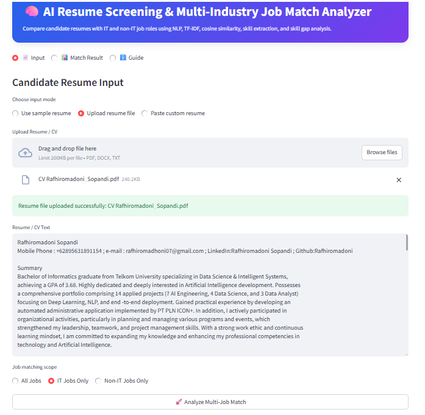
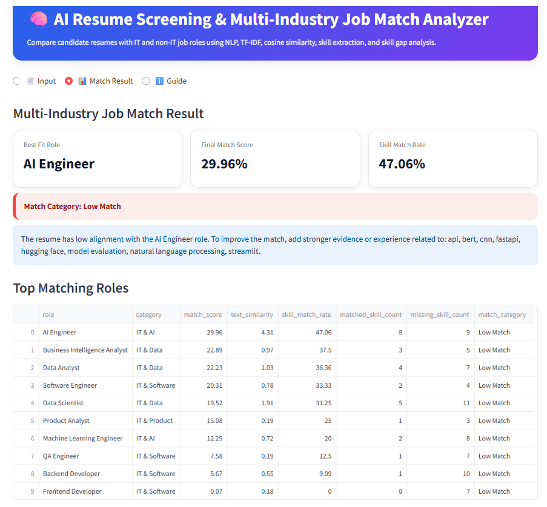
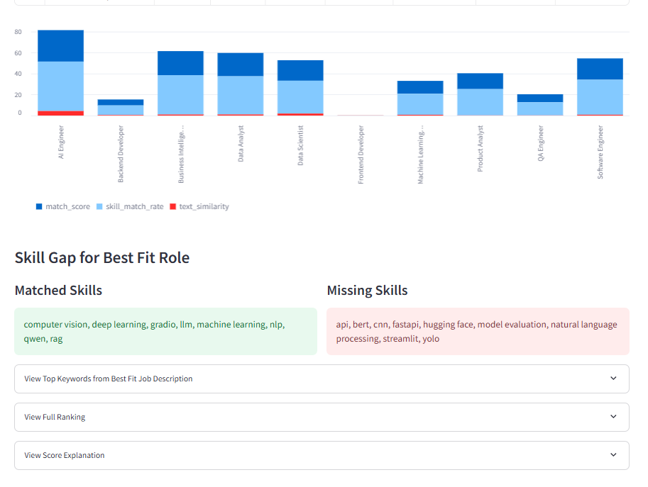

# AI Resume Screening & Multi-Industry Job Match Analyzer

## Project Overview

AI Resume Screening & Multi-Industry Job Match Analyzer is an NLP-based application designed to compare a candidate resume with multiple job descriptions across IT and non-IT roles.

The system analyzes resume content, extracts relevant skills, calculates job-role matching scores, identifies matched and missing skills, and recommends the most suitable job roles for the candidate.

This project demonstrates how natural language processing can support resume screening, job-role recommendation, and skill gap analysis in recruitment and career planning.

---

## Business Problem

Recruiters often need to review many resumes manually and compare them with different job requirements. This process can be time-consuming, subjective, and inconsistent.

Candidates also often struggle to understand which job roles are most aligned with their resume and what skills they need to improve.

This project helps answer:

- Which job role is the best fit for a candidate?
- What skills from the job description are already covered by the resume?
- What skills are missing from the resume?
- Is the candidate more suitable for IT or non-IT roles?
- How can the resume be improved for better job alignment?

---
## App Preview

### Input Page



### Match Result Page




## Objectives

The objectives of this project are:

- Build a resume-job matching system using NLP.
- Support resume input from PDF, DOCX, TXT, sample resume, or manual text.
- Compare a resume against multiple IT and non-IT job descriptions.
- Calculate final job match score using text similarity and skill match rate.
- Rank top matching roles.
- Identify matched and missing skills.
- Generate recommendation for resume improvement.
- Deploy the solution as an interactive Streamlit app.

---

## Key Features

- Resume upload support: PDF, DOCX, and TXT.
- Manual resume text input.
- Sample resume selection for testing.
- Multi-industry job matching.
- IT and non-IT job scope filtering.
- Best-fit job role recommendation.
- Top matching roles ranking.
- Matched skills detection.
- Missing skills detection.
- Match category classification:
  - Strong Match
  - Moderate Match
  - Low Match
- Score explanation using TF-IDF cosine similarity and skill match rate.

---

## Methodology

The project uses a lightweight NLP workflow:

1. Load resume text.
2. Load job descriptions from IT and non-IT role files.
3. Clean and normalize text.
4. Extract skills using a predefined skill dictionary.
5. Convert resume and job description text into TF-IDF vectors.
6. Calculate cosine similarity.
7. Calculate skill match rate.
8. Combine both scores into a final match score.
9. Rank job roles by match score.
10. Generate recommendation based on missing skills.

Final score formula:

```text
Final Match Score = 40% Text Similarity + 60% Skill Match Rate
